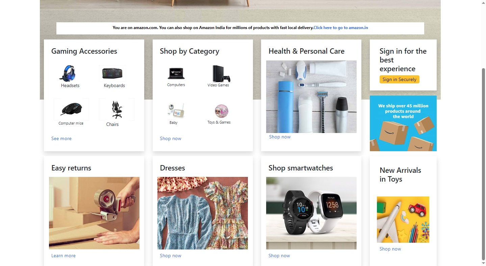

# Amazon Responsive Webpage Clone

## Overview

This project is a responsive webpage clone of the Amazon website, created using HTML, CSS, and Bootstrap. The goal is to showcase design skills and the ability to create a responsive user interface.

## Features

- Responsive design for various devices (desktop, tablet, mobile).
- Utilizes Bootstrap for styling and layout.
- Background image from Amazon for an authentic look.

## Demo

Check out the live demo [here](https://first-page-of.glitch.me/amazon-responsive.html).


## Screenshots

### Desktop View




### Tablet View


### Mobile View


## Getting Started

Clone the repository:

   ```bash
   git clone https://github.com/your-username/Amazon-responsive.git